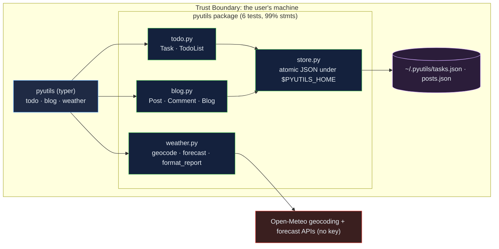

# python-utilities: three small tools as one typed, tested, installable command

[](https://github.com/Freddricklogan/python-utilities/actions/workflows/deploy.yml)
[](#5-getting-started--verification)
[](https://github.com/Freddricklogan/python-utilities/actions/workflows/codeql.yml)
[](LICENSE)

## 1. Executive Summary & Business Impact

**Problem statement.** Three scripts — a task list, a blog manager and
a "weather app" — each with its own argument parser and JSON file,
writing into whatever directory they were run from, validating nothing,
and, in the weather app's case, generating temperatures with
`random.uniform` (`AUDIT.md`).

**Solution & value delivered.** `pyutils`, one typer command installable
with `pipx` or `uv tool`: `todo` (validated tasks with priorities, due
dates, overdue and statistics), `blog` (posts with unique slugs, word
counts, reading time, comments, search, publish state) and `weather`
(real current conditions and a daily forecast from Open-Meteo, no key).
Pydantic models validate every record; writes are atomic; data lives in
one directory. Six tests at 99 % statement coverage; the weather parser
is tested on recorded responses and the CLI is installed and run in CI.

**[→ Read the full case study](docs/CASE_STUDY.md)**

## 2. Demonstrated Competencies & Technical Skills

- **Python Fundamentals** — typed package with a typer CLI, Pydantic v2
  validation, atomic JSON persistence, `StrEnum`, dataclasses, injected
  HTTP for testability.
- **Honesty about results** — the mock weather generator is replaced
  by a real, keyless API, and the README shows a live run.
- **Engineering Practice** — ruff, mypy strict, pytest with coverage,
  bandit, pip-audit, Trivy; CI installs the tool from the checkout.

## 3. System Architecture & Data Flow



## 4. Technical Highlights & Engineering Decisions

### ADR-1 — Real weather or none

**Context.** The old app generated random readings and presented them
as a forecast.

**Decision.** Open-Meteo's geocoding and forecast endpoints (no key,
no account); WMO weather codes mapped to words; `fetch` is an argument
so tests use recorded responses.

**Consequence.** A live run for Chicago returned 16 °C, overcast,
humidity 81 %, wind 28 km/h with a two-day forecast; an unknown place
raises `LookupError` with the name.

### ADR-2 — Validate before you mutate

**Context.** A first draft of `Blog.edit` set fields and then validated,
leaving a post blank when validation failed; a test caught it.

**Decision.** Build the edited record, validate it, then replace the
original in one step. Pydantic models guard every record on load and
on creation too.

**Consequence.** A rejected edit changes nothing, and a hand-edited JSON
file with a bad record fails loudly on load.

### ADR-3 — One data directory, atomic writes

**Context.** Scripts wrote wherever they ran and could leave truncated
files.

**Decision.** `PYUTILS_HOME` (default `~/.pyutils`), temp-file-and-
replace writes.

**Consequence.** Tests run in a temporary directory; an interrupted save
cannot corrupt the store.

## 5. Getting Started & Verification

**Prerequisites.** Python 3.12; `uv` or `pipx`.

```bash
git clone https://github.com/Freddricklogan/python-utilities.git
cd python-utilities
uv tool install --from . pyutils-fl          # or: pipx install .
pyutils todo add "Write the report" -p high --due 2026-09-25
pyutils todo list
pyutils blog new "First post" --body draft.md -t notes
pyutils blog list
pyutils weather "Chicago" --days 3
uv venv && uv pip install -e ".[dev]" && make check   # lint, typecheck, tests, security
```

**Verification — the numbers this repository actually produced:**

| Check | Result |
| --- | --- |
| Tests (pytest) | **6 passed / 6** |
| Coverage | **99%** statements over `pyutils` (CLI excluded) |
| ruff, ruff format, mypy --strict | clean (8 files) |
| bandit, pip-audit | 0 findings; no known vulnerabilities |
| Install | `uv tool install --from . pyutils-fl` → 1 executable; `pyutils --help` lists todo, blog, weather |
| Live | `pyutils weather Chicago --days 2` → Chicago, United States (41.85, −87.65): 16 °C, overcast, humidity 81 %, wind 28 km/h; `pyutils weather "Nowhereville Zzz"` → `LookupError: no place found` |

## 6. Live Demo & Production Showcase

No web page: the artefact is a command-line package. Install it from
the repository as above. There is no registry publication; the `pipx`
and `uv tool` install paths are exercised in CI on every run.
